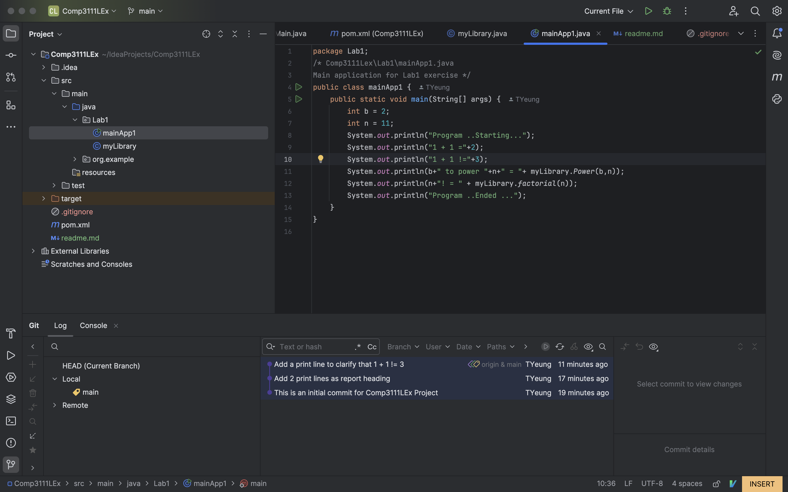

# Overview

This project implemented two functionalities as a self-contained Library: calculating power and factorial.

# Highlight
A report heading is printed together with the result for Power(b,n) and factorial(n).

